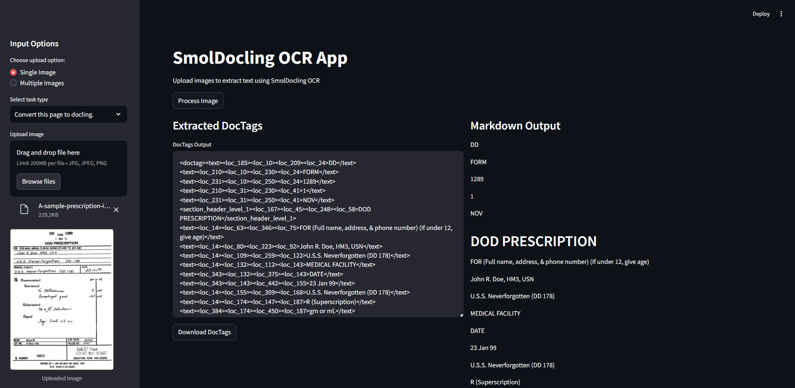

# SmolDocling OCR App

A Streamlit application that leverages the power of SmolDocling for advanced document OCR (Optical Character Recognition). This app extracts text from document images with high accuracy and produces structured output in both DocTags and Markdown formats.



## Features

- **Single or Multiple Image Processing**: Upload one image or batch process multiple documents
- **Specialized Document Processing**: Support for various document types including:
  - General document conversion
  - Table extraction (OTSL format)
  - Code extraction
  - Formula conversion to LaTeX
  - Chart data extraction
  - Section header extraction
- **Structured Output Formats**: Results provided in both DocTags format and rendered Markdown
- **Download Options**: Save extraction results for further use

## Requirements

- Python 3.12+
- Hugging Face account with API token (for model access)

## Installation

1. Clone this repository:
   ```bash
   git clone https://github.com/AIAnytime/SmolDocling-OCR-App
   cd smoldocling
   ```

2. Install dependencies using UV (recommended):
   ```bash
   uv pip install -r requirements.txt
   ```
   
   Alternatively, using pip:
   ```bash
   pip install -r requirements.txt
   ```

3. Create a `.env` file in the project root with your Hugging Face token:
   ```
   HF_TOKEN=your_huggingface_token_here
   ```

## Usage

1. Start the Streamlit app:
   ```bash
   streamlit run main.py
   ```

2. Open your browser and navigate to the displayed URL (typically http://localhost:8501)

3. Use the sidebar to:
   - Select single or multiple image upload mode
   - Choose the processing task type
   - Upload your document image(s)

4. Click "Process Image(s)" to start the OCR

5. View and download results in DocTags and Markdown formats

## Dependencies

- streamlit - Web application framework
- torch - Deep learning framework
- transformers - Hugging Face Transformers library
- docling-core - Document processing toolkit
- huggingface_hub - Hugging Face model hub integration
- Pillow - Image processing library
- python-dotenv - Environment variable management
- accelerate - Optional for hardware acceleration
- PyMuPDF - pdf data extraction, analysis, conversion & manipulation library

## License

MIT License

This project is licensed under the MIT License - see the [LICENSE](LICENSE) file for details.

## Acknowledgements

This project uses the SmolDocling model from [DS4SD/SmolDocling-256M-preview](https://huggingface.co/ds4sd/SmolDocling-256M-preview).
